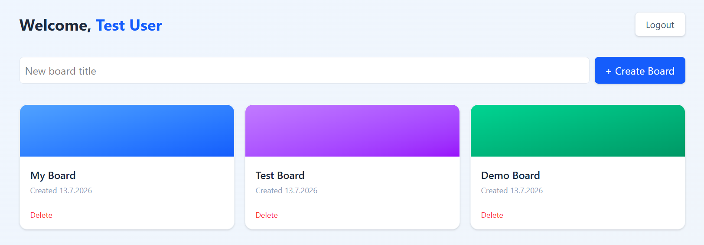
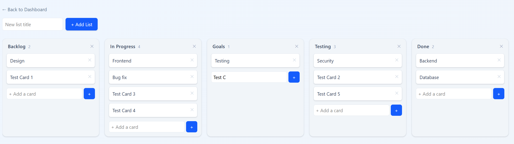

# Kanban Board App

A full-stack Kanban board application (Trello-style) built with Spring Boot and React, featuring JWT authentication, drag-and-drop task management, and full Docker support.

Frontend repo: [kanban-frontend](https://github.com/hamzameto/kanban-frontend)

## Features

- User registration and login with JWT authentication
- Create, view, and delete boards
- Create, update, and delete lists within a board
- Create, update, and delete cards within a list
- Drag-and-drop reordering of cards (within and across lists)
- Drag-and-drop reordering of lists
- Ownership-based access control (users can only access their own boards)
- Fully containerized with Docker Compose
- Automated CI pipeline (build + test) via GitHub Actions

## Tech Stack

**Backend**
- Java 25, Spring Boot 4
- Spring Security + JWT (jjwt)
- Spring Data JPA + PostgreSQL
- JUnit 5 + Mockito for testing
- Maven

**Frontend**
- React (Vite)
- React Router
- Axios
- Tailwind CSS
- @dnd-kit (drag-and-drop)

**Infrastructure**
- Docker & Docker Compose
- GitHub Actions CI

## Screenshots

**Login**


**Dashboard**


**Board view**


## Running with Docker (recommended)

1. Clone both repositories into the same parent folder:
   ```bash
   git clone https://github.com/hamzameto/kanban-project.git
   git clone https://github.com/hamzameto/kanban-frontend.git
   ```

2. Inside `kanban-project`, create a `.env` file:
   ```
   DB_USERNAME=postgres
   DB_PASSWORD=yourpassword
   JWT_SECRET=your-32-character-or-longer-secret
   ```

3. From inside `kanban-project`, run:
   ```bash
   docker compose up --build
   ```

4. Open [http://localhost:5173](http://localhost:5173)

## Running locally (without Docker)

**Backend**
1. Requires Java 25 and a running PostgreSQL instance
2. Create a database named `kanban`
3. Set environment variables: `DB_USERNAME`, `DB_PASSWORD`, `JWT_SECRET`
4. Run: `./mvnw spring-boot:run`

**Frontend**
1. Requires Node.js 20+
2. `npm install`
3. `npm run dev`

## Testing

Backend unit tests cover authentication logic, ownership/security checks, and controller behavior:
```bash
./mvnw test
```

## Architecture Notes

- Passwords are hashed with BCrypt, never stored in plain text
- JWT tokens are stateless and validated on every request via a custom security filter
- Ownership checks are enforced at the service layer for every board, list, and card operation
- Card/list ordering uses a `position` field, re-synced across all affected items on every reorder